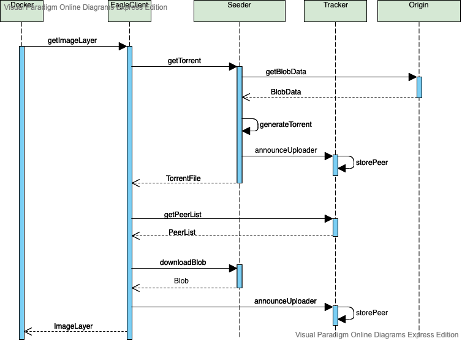
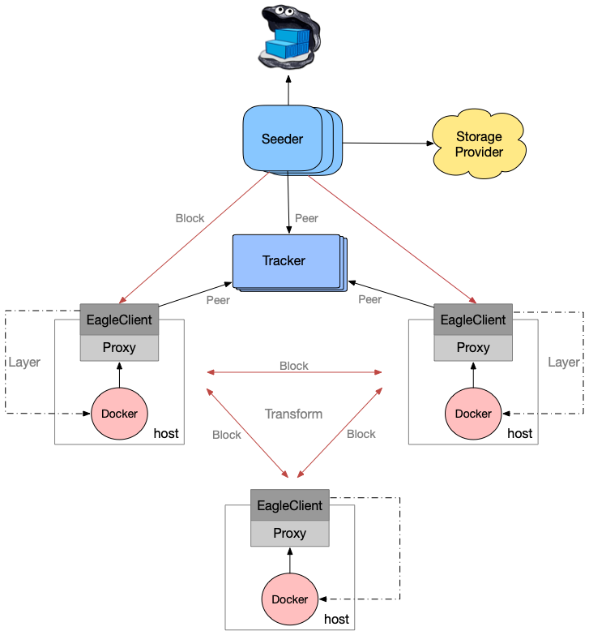

Eagle Design Document
=====================

## Componens

Eagle consists of several components as below:

- Proxy
  - Deployed on every host
  - Proxy the blob request(EagleClient => Original Request)
- EagleClient
  - Announces available content to tracker
  - Connects to peers returned by tracker to download or upload content
- Seeder
  - Stores blobs as files on disk backed by pluggable storage (e.g. FileSystem, S3)
  - Provides meta info of blob to EagleClient and acts as the first uploader
- [Tracker](https://github.com/chihaya/chihaya)
  - Tracks which peers have what content (both in-progress and completed)
  - Provides ordered lists of peers to connect to for any given blob
- Origin
  - Docker Distribution

## Principle
  
When pulling image through Eagle, Eagle Proxy will receive blob layer request and forward it to EagleClient. EagleClient first checks whether or not the relevant blob cache exists, and returns blob data if it exists, otherwise enters the bt download process.

EagleClient will get torrent of blob from seeder using [grpc](https://github.com/grpc/grpc-go) and download blob data through p2p peer network system.

When receiving torrent request from EagleClient, Seeder first checks whether or not the relevant blob cache exists, and returns blob data if it exists, otherwise it fetchs data from remote Origin(Docker Distribution) and announces itself as the first blob uploader to Tracker.            

The request process of Eagle shows below:



And the architecture of Eagle can be illustrated as follows:

  

## Torrent Transfer

EagleClient gets blob torrent from seeder through grpc protocol

`metainfo.proto`:

```
syntax = "proto3";

package metainfo;

// The metainfo service definition.
service MetaInfo {
  // Get metainfo
  rpc GetMetaInfo (MetaInfoRequest) returns (MetaInfoReply) {}
}

// The request message containing the source request
message MetaInfoRequest {
  string url = 1;
}

// The response message containing the metainfo bytes
message MetaInfoReply {
  bytes metainfo = 1;
}
``` 

EagleClient `newMetaInfoClient`: 

```go
func (e *BtEngine) newMetaInfoClient() (pb.MetaInfoClient, error) {
	rsv, err := endpoint.NewResolverGroup("eagleclient")
	if err != nil {
		return nil, err
	}
	rsv.SetEndpoints(e.seeders)

	name := fmt.Sprintf("eagleclient-%s", picker.RoundrobinBalanced.String())
	balancer.RegisterBuilder(balancer.Config{
		Policy: picker.RoundrobinBalanced,
		Name:   name,
		Logger: zap.NewExample(),
	})
	conn, err := grpc.Dial(fmt.Sprintf("endpoint://eagleclient/"), grpc.WithInsecure(), grpc.WithBalancerName(name))
	if err != nil {
		return nil, fmt.Errorf("failed to dial seeder: %s", err)
	}
	return pb.NewMetaInfoClient(conn), nil
}
```

Seeder `GetMetaInfo`:

```go
// GetMetaData get torrent of layer
func (s *Seeder) GetMetaInfo(ctx context.Context, metaInfoReq *pb.MetaInfoRequest) (*pb.MetaInfoReply, error) {
	log.Debugf("Access: %s", metaInfoReq.Url)
	digest := metaInfoReq.Url[strings.LastIndex(metaInfoReq.Url, "/")+1:]
	id := distdigests.Digest(digest).Encoded()
	log.Debugf("Start to get metadata of layer %s", id)
	err := s.getMetaDataSync(metaInfoReq.Url, id)
	if err != nil {
		return nil, fmt.Errorf("Get metainfo from origin failed: %v", err)
	}
	torrentFile := s.storage.GetTorrentFilePath(id)
	content, err := s.storage.Download(torrentFile)
	if err != nil {
		return nil, fmt.Errorf("Download metainfo file failed: %v", err)
	}
	return &pb.MetaInfoReply{Metainfo: content}, nil
}
```

## Seeder Storage Interface(SSI)

Eagle Seeder plugs into reliable blob storage options, like local FileSystem or S3. The seeder storage interface is simple and new options are easy to add.

```bash
$ tree lib
lib
└── backend
    ├── fsbackend
    │   ├── config.go
    │   ├── fs.go
    │   └── storage.go
    └── storage.go
```

```go
// Storage defines an interface for accessing blobs on a remote storage backend.
//
// Implementations of Storage must be thread-safe, since they are cached and
// used concurrently by Manager.
type Storage interface {
	// Create creates torrent with meta info
	CreateWithMetaInfo(name string, info *metainfo.MetaInfo) error

	// Stat is useful when we need to quickly know if a blob exists (and maybe
	// some basic information about it), without downloading the entire blob,
	// which may be very large.
	Stat(name string) (*FileInfo, error)

	// Upload uploads data into name.
	Upload(name string, data []byte) error

	// Download downloads name into dst. All implementations should return
	// backenderrors.ErrBlobNotFound when the blob was not found.
	Download(name string) ([]byte, error)

	// Delete removes relevant name
	Delete(name string) error

	// List lists entries whose names start with prefix.
	List(prefix string) ([]*FileInfo, error)

	// GetFilePath returns data path
	GetFilePath(id string) string

	// GetTorrentFilePath returns torrent path
	GetTorrentFilePath(id string) string

	// GetDataDir returns directory of data
	GetDataDir() string

	// GetTorrentDir returns directory of torrent
	GetTorrentDir() string
}
```

## LRUCache

Eagle achieves a thread-safe LRUCache, which is used by both EagleClient and Seeder to manage disk space. Besides, Eagle LRUCache get blob data from remote origin only once when there are multiple blob requests from EagleClient at the same time. 

For a more detailed information of Eagle LRUCache, refer to [LRUcache codes](../../pkg/utils/lrucache/lrucache.go). 

## Code Structure

Both Eagle Proxy and Seeder use the same code structure to construct a clear project view of Eagle as below:

```bash
$ tree seeder
seeder
├── bt
│   └── seeder.go
├── cmd
│   ├── cmd.go
│   └── config.go
└── main.go

$ tree proxy
proxy
├── cmd
│   ├── cmd.go
│   └── config.go
├── main.go
├── routes
│   ├── process.go
│   └── route.go
└── transport
    └── transport.go
```   

`main.go`:

```go
package main

import "github.com/duyanghao/eagle/proxy/cmd"

func main() {
	cmd.Run(cmd.ParseFlags())
}
```

## High Availability

Eagle achieves a client-side high-availability for Seeder and Tracker.

* Seeder: client-side high-availabilty of Seeder is achieved by simulating the [etcd clientv3-grpc1.23 Balancer](../../docs/concepts/ha-and-scaling.md)

## Refs

* [etcd Client Design](https://github.com/etcd-io/etcd/blob/master/Documentation/learning/design-client.md)
* [Full-featured BitTorrent client package and utilities](https://github.com/anacrolix/torrent)